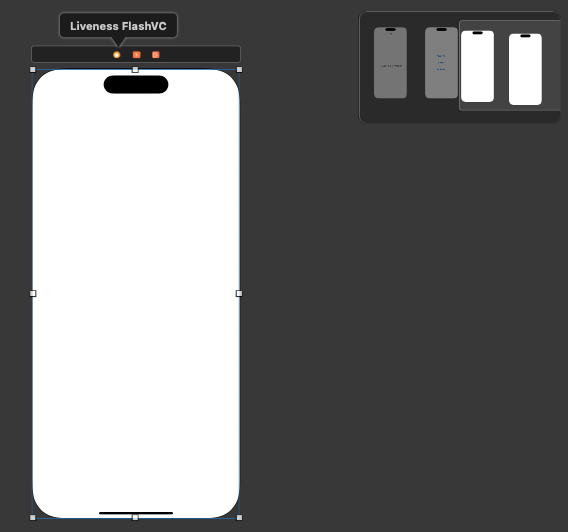

# FlashLiveness

The mobile iOS SDK of FlashLiveness.

## Example

To run the example project, see **LivenessCloudSample** folder or [FlashLiveness Sample](https://github.com/stevienguyen1988/livenessCloudSample.git)

## Requirements

iOS >= 11.0, Objc or Swift

## Installation

### Cocoapod
To install FlashLiveness, simply add the following line to your Podfile:

```ruby
pod 'FlashLiveness', :git => 'https://github.com/stevienguyen1988/FlashLivenessPod.git'
```

### Manual
Step 1: Drag the FlashLiveness.xcframework into your app, check "Copy Items if needed"

Step 2: Open your project target, in General tab, see the Frameworks, Libraries, and Embedded Content, make sure FlashLiveness.xcframework that is Embeded and Sign

## Implement code

### Bước 1: Setup key cho hệ thống

setup key ở hàm **didFinishLaunchingWithOptions** tại **AppDelegate** như sau:

```swift
func application(_ application: UIApplication, didFinishLaunchingWithOptions launchOptions: [UIApplication.LaunchOptionsKey: Any]?) -> Bool {
    // Override point for customization after application launch.
    Networking.shared.resetDeviceInfo()        
    let urlPrivate = Bundle.main.url(forResource: "com.qts.test", withExtension: "txt")
    let urlPublic = Bundle.main.url(forResource: "eid", withExtension: "txt")
    let privateKey = try! String(contentsOf: urlPrivate!, encoding: .utf8)
    let publicKey = try! String(contentsOf: urlPublic!, encoding: .utf8)
    Networking.shared.setup(appId: "com.pvcb", logLevel: .debug, url: "https://ekyc-sandbox.eidas.vn/face-matching", publicKey: publicKey, privateKey: privateKey)
    let resposne = Networking.shared.generateDeviceInfor(deviceId: "testtest")
    print(resposne)
    return true
}
```

Trong đó:
- appId: tên ứng dụng đăng kí với hệ thống
- private Key và public Key là do hệ thống backend sinh ra cung cấp
-  url : Đường dẫn đến hệ thống backend

### Bước 2: Đăng ký face

Đăng kí face để thực hiện so khớp khuôn mặt sau khi livenesscheck
Nếu đã thực hiện trên server thì có thể bỏ qua bước này

```swift
Task {
    do {
        let response = try await Networking.shared.registerFace(faceImage: UIImage(named: "image.png")!,paramHeader: ["header":"header"])
        print(response.data)
    } catch {
        
    }
}
```

### Bước 3: khởi tạo *transactionId*

Trước khi thực hiện liveness check cần khởi tạo 1 transactionId

```swift
Task {
    do {
        let response = try await Networking.shared.initTransaction(additionParam: ["clientTransactionId":clienttransaction])
        if response.status == 200{
            let storyboard = UIStoryboard(name: "Main", bundle: nil)
            let vc = storyboard.instantiateViewController(withIdentifier: "LivenessFlashVC") as! LivenessFlashVC
            vc.transactionId = response.data
            vc.clientTransaction = self.clienttransaction
            self.navigationController?.pushViewController(vc, animated: true)
        }
    }catch{
        let alert = UIAlertController(title: "Info", message: error.localizedDescription, preferredStyle: .alert)
        alert.addAction(UIAlertAction(title: "OK", style: .destructive))
        self.present(alert, animated: true)
    }
}
```

### Bước 4: setup thực hiện luồng FlashLiveness

Khởi tạo 1 view trên màn hình để tiến hành thực hiện việc liveness check chỉ trên phần
view đó



Khởi tạo biến **livenessDetector** trong **viewDidLoad**

```swift
var livenessDetector: LivenessUtilityDetector?

override func viewDidLoad() {
    super.viewDidLoad()

    self.livenessDetector = LivenessUtil.createLivenessDetector(previewView: self.previewView, mode: .online, filterColors: [.red, .green, .blue], delegate: self)
}
```

Trong đó
- previewView: phần view hiển thị liveness check
- mode: cách thức FlashLiveness online hoặc offline. Trả kết quả khác nhau ở delegate
- filterColors: mảng chứa các màu dùng để custom filter trong quá trình liveness, có thể truyền hoặc không. Nếu không truyền thì sẽ mặc định trả về delegate: ảnh nguyên bản và ảnh màu gen từ server. Nếu truyền thì sẽ trả về delegate ảnh nguyên bản, ảnh màu gen từ server và ảnh các màu được truyền vào.
- debugging: Có muốn xuất log ra hay không
- delegate: Gán các callback khi thực hiện liveness check

Khi view bắt đầu hiện ra thì bắt đầu startsession ở **viewWillAppear** để thực hiện việc liveness check. Lúc này sẽ thực hiện truyền transactionId vào.

```swift
override func viewWillAppear(_ animated: Bool) {
    super.viewWillAppear(animated)
    do {
        try self.livenessDetector?.getVerificationRequiresAndStartSession(transactionId: self.transactionId)
    } catch{
        
    }
}
```

Sau khi thực hiện livenessCheck xong sẽ callback ngược lại thông qua *delegate*

Ở mode online, khi thành công sẽ callback về **didFinishWithResult**

```swift
func liveness(_ liveness: LivenessUtilityDetector, didFinishWithResult result: LivenessResult) {
    guard let json = try? JSONSerialization.data(withJSONObject: result.data) else {
        return
    }
    let alert = UIAlertController(title: "Response", message: String(data: json, encoding: .utf8), preferredStyle: .alert)
    alert.addAction(UIAlertAction(title: "OK", style: .destructive, handler: { _ in
        try? self.livenessDetector?.getVerificationRequiresAndStartSession()
    }))
    DispatchQueue.main.async {
        self.present(alert, animated: true)
    }
}
```

Ở mode offline, khi thành công sẽ callback về **didFinishWithFaceImages**, trong đó param **images** là đối tượng gồm các trường dữ liệu:
- **originalImage**: ảnh liveness nguyên bản không màu
- **attemptImage**: ảnh liveness với màu từ server
- **images**: mảng các ảnh liveness với các màu truyền vào filterColors từ hàm **createLivenessDetector**

```swift
func liveness(_ liveness: LivenessUtilityDetector, didFinishWithFaceImages images: LivenessFaceImages) {
    UIImageWriteToSavedPhotosAlbum(images.originalImage, nil, nil, nil)
    UIImageWriteToSavedPhotosAlbum(images.attemptImage, nil, nil, nil)
    images.images?.forEach { image in
        UIImageWriteToSavedPhotosAlbum(image, nil, nil, nil)
    }
    let alert = UIAlertController(title: "Response", message: "Thành công", preferredStyle: .alert)
    alert.addAction(UIAlertAction(title: "OK", style: .destructive, handler: { _ in
        try? self.livenessDetector?.getVerificationRequiresAndStartSession(transactionId: self.transactionId)
    }))
    DispatchQueue.main.async {
        self.present(alert, animated: true)
    }
}
```

Khi thất bại, sẽ callback về **didFail**

```swift
func liveness(_ liveness: LivenessUtilityDetector, didFail withError: LivenessError) {
    print("Liveness failed because of \(withError)")
}
```

## Authors

* **Nguyễn Thanh Bình** - *QTS*
